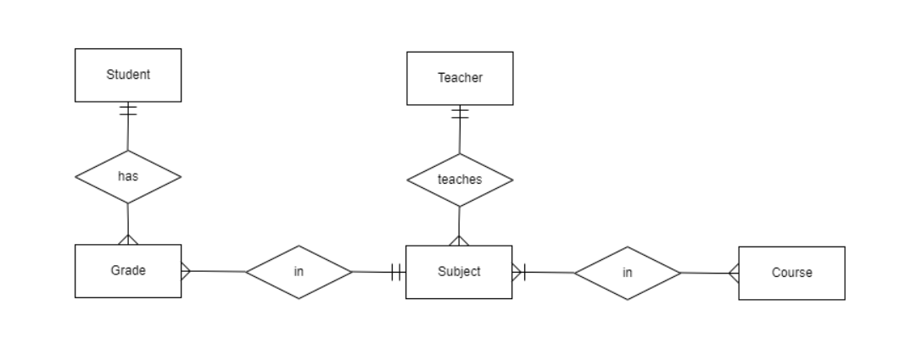

# CollegeManagementTest
An interview test I did.
# Specifications
Create a college management system which must be able to keep the registration of courses, subjects, teachers and students of a university. Each college course must have multiple subjects, which in turn, contain one teacher and many students. Furthermore, the system must store the name, birthday, and salary of teachers. For the students it must save the name, birthday, registration number and the students grade in the subjects enrolled.
## Requisites
* Create a CRUD of the entities (Courses, Subjects, Teacher, Student, Grades)
* List the courses and show the number of teachers, students and average of their grades for each course
* List the subjects and show the teacher information, number of students and their grades for each subject
* List the students and their respectives grades of the subject
## Architecture
* ASP MVC 5
* SQL Server using Entity Framework 6 and LocalDB
* AngularJS
* SignalR
## The ER model I came up with
For convenience, Grades are the N-to-N table for the Student-Subject relationship. This diagram was done using [ERDPlus](https://erdplus.com/).

## Additional notes
The boilerplate-branch has a boilerplate version for the whole project.
